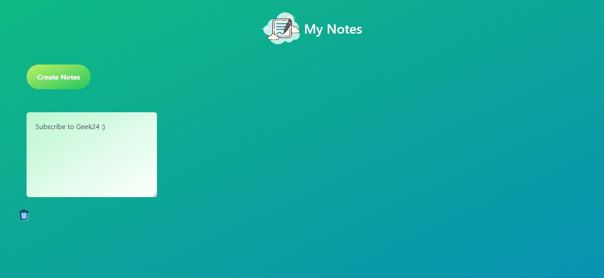

# My Note React App

A simple notes-taking application built with React and styled using Tailwind CSS. The application uses local storage to persist notes.

## Features

- Create, edit, and delete notes.
- Notes are stored locally for persistence.
- Stylish design with Tailwind CSS.

## Demo

Check out the live demo [here](https://my-note-react-tailwind.vercel.app/).

# React + Vite

This template provides a minimal setup to get React working in Vite with HMR and some ESLint rules.

Currently, two official plugins are available:

- [@vitejs/plugin-react](https://github.com/vitejs/vite-plugin-react/blob/main/packages/plugin-react/README.md) uses [Babel](https://babeljs.io/) for Fast Refresh
- [@vitejs/plugin-react-swc](https://github.com/vitejs/vite-plugin-react-swc) uses [SWC](https://swc.rs/) for Fast Refresh

# Technologies Used

1. React
2. Tailwind CSS

# Contributing

If you would like to contribute, please fork the repository and submit a pull request.